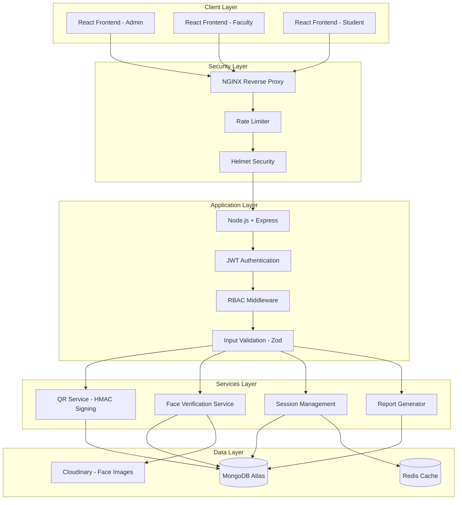
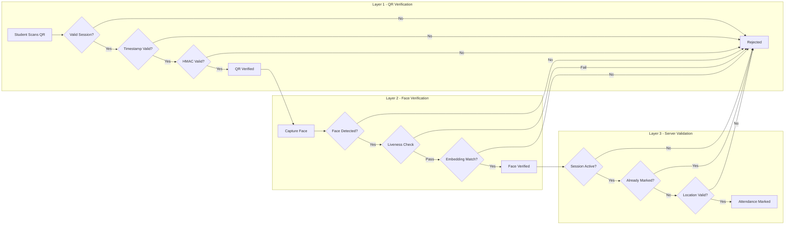
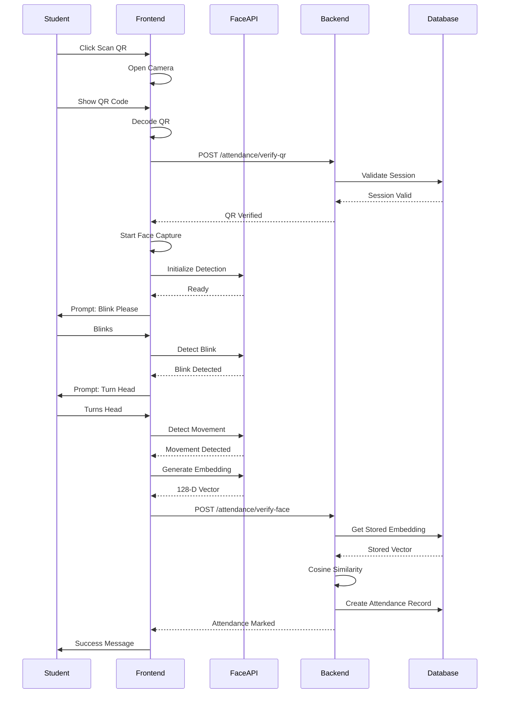
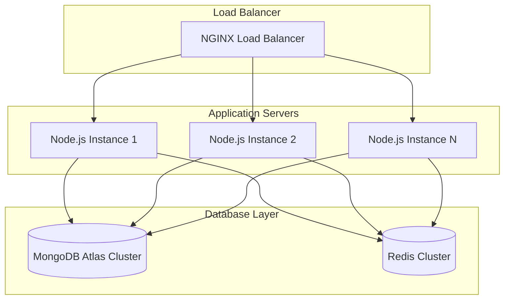

# Secure Smart Attendance System - Architecture Plan

## Executive Summary

This document outlines the complete architecture for a production-ready, secure web-based attendance system that prevents proxy attendance through rotating QR codes and face verification with liveness detection.

---

## 1. System Architecture Overview



---

## 2. Database Schema Design

### 2.1 User Model Extension

```javascript
// src/models/user.model.js - Extended Schema
const userSchema = new Schema({
  // Existing fields from current schema
  email: { type: String, required: true, unique: true, lowercase: true, trim: true },
  password: { type: String, required: true },
  refreshToken: { type: String },
  
  // New fields for attendance system
  name: { type: String, required: true, trim: true },
  role: { 
    type: String, 
    enum: ['student', 'faculty', 'admin'], 
    required: true,
    default: 'student'
  },
  department: { 
    type: Schema.Types.ObjectId, 
    ref: 'Department',
    required: true 
  },
  enrollmentNumber: { 
    type: String, 
    unique: true, 
    sparse: true,  // Only required for students
    trim: true 
  },
  employeeId: {
    type: String,
    unique: true,
    sparse: true,  // Only required for faculty/admin
    trim: true
  },
  faceEmbeddingId: {
    type: Schema.Types.ObjectId,
    ref: 'FaceEmbedding'
  },
  faceRegistered: { type: Boolean, default: false },
  isActive: { type: Boolean, default: true },
  lastLogin: { type: Date },
  
  // Avatar from existing schema
  avatar: { type: String, default: 'default-avatar-url' }
}, { timestamps: true });

// Indexes
userSchema.index({ email: 1 });
userSchema.index({ enrollmentNumber: 1 }, { sparse: true });
userSchema.index({ employeeId: 1 }, { sparse: true });
userSchema.index({ department: 1, role: 1 });
```

### 2.2 Department Model

```javascript
// src/models/department.model.js
const departmentSchema = new Schema({
  name: { type: String, required: true, unique: true, trim: true },
  code: { type: String, required: true, unique: true, uppercase: true },
  description: { type: String },
  head: { type: Schema.Types.ObjectId, ref: 'User' },  // Department HOD
  isActive: { type: Boolean, default: true }
}, { timestamps: true });
```

### 2.3 Class Model

```javascript
// src/models/class.model.js
const classSchema = new Schema({
  name: { type: String, required: true, trim: true },
  subjectCode: { type: String, required: true, uppercase: true },
  subjectName: { type: String, required: true },
  faculty: { type: Schema.Types.ObjectId, ref: 'User', required: true },
  department: { type: Schema.Types.ObjectId, ref: 'Department', required: true },
  students: [{ type: Schema.Types.ObjectId, ref: 'User' }],
  schedule: [{
    day: { type: String, enum: ['Monday', 'Tuesday', 'Wednesday', 'Thursday', 'Friday', 'Saturday'] },
    startTime: { type: String },  // HH:mm format
    endTime: { type: String },
    room: { type: String }
  }],
  academicYear: { type: String, required: true },
  semester: { type: Number, required: true },
  isActive: { type: Boolean, default: true }
}, { timestamps: true });

classSchema.index({ subjectCode: 1, academicYear: 1 });
classSchema.index({ faculty: 1 });
```

### 2.4 AttendanceSession Model

```javascript
// src/models/attendanceSession.model.js
const attendanceSessionSchema = new Schema({
  classId: { type: Schema.Types.ObjectId, ref: 'Class', required: true },
  facultyId: { type: Schema.Types.ObjectId, ref: 'User', required: true },
  sessionToken: { type: String, required: true, unique: true },  // JWT-based session ID
  qrSecret: { type: String, required: true },  // HMAC secret for QR signing
  qrRefreshInterval: { type: Number, default: 15 },  // seconds
  startTime: { type: Date, required: true },
  endTime: { type: Date },
  scheduledEndTime: { type: Date },
  isActive: { type: Boolean, default: true },
  location: {
    latitude: { type: Number },
    longitude: { type: Number },
    radius: { type: Number, default: 100 }  // meters
  },
  totalStudents: { type: Number, default: 0 },
  presentCount: { type: Number, default: 0 },
  metadata: {
    deviceInfo: { type: String },
    ipAddress: { type: String }
  }
}, { timestamps: true });

attendanceSessionSchema.index({ classId: 1, startTime: -1 });
attendanceSessionSchema.index({ facultyId: 1, isActive: 1 });
attendanceSessionSchema.index({ sessionToken: 1 });
```

### 2.5 Attendance Record Model

```javascript
// src/models/attendance.model.js
const attendanceSchema = new Schema({
  sessionId: { type: Schema.Types.ObjectId, ref: 'AttendanceSession', required: true },
  studentId: { type: Schema.Types.ObjectId, ref: 'User', required: true },
  classId: { type: Schema.Types.ObjectId, ref: 'Class', required: true },
  
  // Verification status
  qrVerified: { type: Boolean, default: false },
  faceVerified: { type: Boolean, default: false },
  livenessScore: { type: Number },  // 0-1 confidence score
  
  // Timestamps
  qrScannedAt: { type: Date },
  faceVerifiedAt: { type: Date },
  markedAt: { type: Date, default: Date.now },
  
  // Location data
  location: {
    latitude: { type: Number },
    longitude: { type: Number }
  },
  
  // Device information
  deviceInfo: { type: String },
  ipAddress: { type: String },
  
  // Face verification details
  faceVerificationDetails: {
    similarityScore: { type: Number },
    livenessChecks: {
      blink: { type: Boolean },
      headMovement: { type: Boolean },
      timestamp: { type: Date }
    }
  },
  
  // Status
  status: { 
    type: String, 
    enum: ['present', 'absent', 'late', 'excused'],
    default: 'present' 
  }
}, { timestamps: true });

// Compound index to prevent duplicate attendance
attendanceSchema.index({ sessionId: 1, studentId: 1 }, { unique: true });
attendanceSchema.index({ studentId: 1, markedAt: -1 });
```

### 2.6 FaceEmbedding Model

```javascript
// src/models/faceEmbedding.model.js
const faceEmbeddingSchema = new Schema({
  userId: { type: Schema.Types.ObjectId, ref: 'User', required: true, unique: true },
  
  // Face embedding vector (128-dimensional array from face-api.js)
  embedding: [{ type: Number }],  // Array of 128 float values
  
  // Reference image stored in Cloudinary
  referenceImage: {
    publicId: { type: String },
    url: { type: String }
  },
  
  // Registration metadata
  registeredAt: { type: Date, default: Date.now },
  registrationDevice: { type: String },
  
  // Liveness verification during registration
  registrationLiveness: {
    blinkVerified: { type: Boolean },
    headMovementVerified: { type: Boolean }
  },
  
  isActive: { type: Boolean, default: true }
}, { timestamps: true });

faceEmbeddingSchema.index({ userId: 1 });
```

---

## 3. Security Architecture

### 3.1 Three-Layer Verification System



### 3.2 Rotating QR Code System

```javascript
// QR Code Payload Structure
{
  sessionId: String,      // MongoDB ObjectId
  timestamp: Number,      // Unix timestamp in seconds
  signature: String       // HMAC-SHA256 signature
}

// Signature Generation
signature = HMAC-SHA256(
  sessionId + timestamp,
  sessionSecret
)

// Validation Rules
1. Timestamp must be within 15 seconds of current time
2. Signature must match computed HMAC
3. Session must be active in database
4. Session must not have ended
```

### 3.3 Anti-Proxy Security Matrix

| Threat | Prevention Mechanism | Implementation |
|--------|---------------------|----------------|
| QR Screenshot | 15-second expiry | Timestamp validation |
| Remote Sharing | Expiry window | Server-side time check |
| WhatsApp Forwarding | Time-based invalidation | HMAC signature |
| Fake Face Photo | Liveness detection | Blink + head movement |
| Video Replay | Active liveness checks | Random challenge prompts |
| Duplicate Marking | Compound index | MongoDB unique constraint |
| Replay Attack | HMAC validation | Session-specific secret |
| Session Hijacking | JWT + HTTPS | Secure cookies |
| Brute Force | Rate limiting | Express-rate-limit |

---

## 4. API Endpoint Design

### 4.1 Authentication Endpoints

```
POST   /api/v1/auth/register          - Register new user (admin only for faculty/student)
POST   /api/v1/auth/login             - Login for all roles
POST   /api/v1/auth/logout            - Logout current session
POST   /api/v1/auth/refresh           - Refresh access token
POST   /api/v1/auth/change-password   - Change password
GET    /api/v1/auth/me                - Get current user profile
```

### 4.2 Admin Endpoints

```
POST   /api/v1/admin/departments                    - Create department
GET    /api/v1/admin/departments                    - List all departments
PUT    /api/v1/admin/departments/:id                - Update department
DELETE /api/v1/admin/departments/:id                - Delete department

POST   /api/v1/admin/faculty                        - Add faculty member
GET    /api/v1/admin/faculty                        - List all faculty
PUT    /api/v1/admin/faculty/:id                    - Update faculty
DELETE /api/v1/admin/faculty/:id                    - Remove faculty

POST   /api/v1/admin/students                       - Add student
POST   /api/v1/admin/students/bulk                  - Bulk import students
GET    /api/v1/admin/students                       - List students
PUT    /api/v1/admin/students/:id                    - Update student
DELETE /api/v1/admin/students/:id                    - Remove student

GET    /api/v1/admin/statistics                     - Dashboard statistics
```

### 4.3 Faculty Endpoints

```
POST   /api/v1/faculty/classes                      - Create class
GET    /api/v1/faculty/classes                      - List my classes
PUT    /api/v1/faculty/classes/:id                  - Update class
DELETE /api/v1/faculty/classes/:id                  - Delete class
POST   /api/v1/faculty/classes/:id/students         - Add students to class

POST   /api/v1/faculty/sessions/start               - Start attendance session
POST   /api/v1/faculty/sessions/:id/end             - End attendance session
GET    /api/v1/faculty/sessions/:id                 - Get session details
GET    /api/v1/faculty/sessions/:id/qr              - Get current QR code
GET    /api/v1/faculty/sessions/active              - List my active sessions

GET    /api/v1/faculty/reports/class/:classId       - Class attendance report
GET    /api/v1/faculty/reports/session/:sessionId   - Session attendance report
GET    /api/v1/faculty/reports/export/:sessionId    - Export CSV
```

### 4.4 Student Endpoints

```
POST   /api/v1/student/face/register               - Register face embedding
POST   /api/v1/student/face/update                 - Update face embedding
GET    /api/v1/student/face/status                 - Check face registration status

POST   /api/v1/student/attendance/verify-qr        - Verify QR code
POST   /api/v1/student/attendance/verify-face      - Submit face for verification
POST   /api/v1/student/attendance/mark             - Complete attendance marking

GET    /api/v1/student/attendance/history          - My attendance history
GET    /api/v1/student/attendance/stats            - My attendance statistics
GET    /api/v1/student/classes                     - My enrolled classes
```

---

## 5. Frontend Architecture

### 5.1 Project Structure

```
frontend/
|-- src/
|   |-- components/
|   |   |-- common/
|   |   |   |-- Button.jsx
|   |   |   |-- Input.jsx
|   |   |   |-- Modal.jsx
|   |   |   |-- Table.jsx
|   |   |   |-- Loading.jsx
|   |   |-- layout/
|   |   |   |-- Header.jsx
|   |   |   |-- Sidebar.jsx
|   |   |   |-- Layout.jsx
|   |   |-- auth/
|   |   |   |-- LoginForm.jsx
|   |   |   |-- RegisterForm.jsx
|   |   |-- qr/
|   |   |   |-- QRScanner.jsx
|   |   |   |-- QRDisplay.jsx
|   |   |-- face/
|   |   |   |-- FaceCapture.jsx
|   |   |   |-- LivenessCheck.jsx
|   |   |   |-- FaceRegistration.jsx
|   |-- pages/
|   |   |-- auth/
|   |   |   |-- LoginPage.jsx
|   |   |   |-- RegisterPage.jsx
|   |   |-- admin/
|   |   |   |-- Dashboard.jsx
|   |   |   |-- DepartmentsPage.jsx
|   |   |   |-- FacultyPage.jsx
|   |   |   |-- StudentsPage.jsx
|   |   |-- faculty/
|   |   |   |-- Dashboard.jsx
|   |   |   |-- ClassesPage.jsx
|   |   |   |-- SessionPage.jsx
|   |   |   |-- ReportsPage.jsx
|   |   |-- student/
|   |   |   |-- Dashboard.jsx
|   |   |   |-- AttendancePage.jsx
|   |   |   |-- HistoryPage.jsx
|   |-- hooks/
|   |   |-- useAuth.js
|   |   |-- useQR.js
|   |   |-- useFace.js
|   |   |-- useApi.js
|   |-- context/
|   |   |-- AuthContext.jsx
|   |   |-- ThemeContext.jsx
|   |-- services/
|   |   |-- api.js
|   |   |-- authService.js
|   |   |-- faceService.js
|   |-- utils/
|   |   |-- faceDetection.js
|   |   |-- liveness.js
|   |   |-- validators.js
|   |-- App.jsx
|   |-- main.jsx
|-- public/
|-- package.json
|-- tailwind.config.js
|-- vite.config.js
```

### 5.2 Face Detection and Liveness Flow



---

## 6. Implementation Phases

### Phase 1: Database Schema Design
- Extend User model with role-based fields
- Create Department, Class, AttendanceSession, Attendance, FaceEmbedding models
- Set up proper indexes for performance

### Phase 2: Backend Core Infrastructure
- Add security middleware (Helmet, rate-limit, CORS)
- Implement Zod validation schemas
- Create RBAC middleware
- Set up Redis for session caching (optional)
- Create QR generation utility with HMAC signing
- Create face embedding comparison utility

### Phase 3: API Controllers and Routes
- Implement all authentication endpoints
- Build Admin management endpoints
- Build Faculty session management endpoints
- Build Student attendance marking endpoints
- Build Report generation endpoints

### Phase 4: Frontend Development
- Set up React project with Vite and Tailwind CSS
- Build authentication pages
- Build role-specific dashboards
- Implement QR scanner with html5-qrcode
- Implement face capture with WebRTC
- Integrate face-api.js for face detection and liveness

### Phase 5: Security Implementation
- Implement rotating QR code system
- Implement liveness detection algorithms
- Add face embedding comparison
- Implement comprehensive audit logging

### Phase 6: Testing and Deployment
- Write API tests
- Create Docker configuration
- Create NGINX configuration
- Set up production environment
- Create deployment documentation

---

## 7. Environment Configuration

```env
# Server Configuration
PORT=5000
NODE_ENV=development

# MongoDB
MONGODB_URI=mongodb+srv://...

# JWT Configuration
ACCESS_TOKEN_SECRET=your-super-secret-key
ACCESS_TOKEN_EXPIRY=1d
REFRESH_TOKEN_SECRET=another-super-secret-key
REFRESH_TOKEN_EXPIRY=10d

# Cloudinary (for face images)
CLOUDINARY_CLOUD_NAME=your-cloud-name
CLOUDINARY_API_KEY=your-api-key
CLOUDINARY_API_SECRET=your-api-secret

# Redis (optional, for caching)
REDIS_URL=redis://localhost:6379

# CORS
CORS_ORIGIN=http://localhost:3000

# QR Code Settings
QR_REFRESH_INTERVAL=15
QR_SECRET_SALT=your-qr-salt

# Face Verification
FACE_SIMILARITY_THRESHOLD=0.6
LIVENESS_CONFIDENCE_THRESHOLD=0.8

# Rate Limiting
RATE_LIMIT_WINDOW_MS=900000
RATE_LIMIT_MAX_REQUESTS=100
```

---

## 8. Dependencies

### Backend Dependencies

```json
{
  "dependencies": {
    "bcrypt": "^5.1.1",
    "cloudinary": "^2.5.1",
    "cookie-parser": "^1.4.7",
    "cors": "^2.8.5",
    "dotenv": "^16.4.5",
    "express": "^4.21.1",
    "express-rate-limit": "^7.4.0",
    "express-validator": "^7.2.0",
    "helmet": "^7.1.0",
    "jsonwebtoken": "^9.0.2",
    "mongoose": "^8.7.1",
    "multer": "^1.4.5-lts.1",
    "qrcode": "^1.5.3",
    "redis": "^4.6.13",
    "uuid": "^9.0.1",
    "zod": "^3.23.8"
  },
  "devDependencies": {
    "nodemon": "^3.1.7",
    "prettier": "^3.3.3"
  }
}
```

### Frontend Dependencies

```json
{
  "dependencies": {
    "react": "^18.3.1",
    "react-dom": "^18.3.1",
    "react-router-dom": "^6.26.2",
    "axios": "^1.7.7",
    "face-api.js": "^0.22.2",
    "html5-qrcode": "^2.3.8",
    "zustand": "^4.5.5",
    "react-hot-toast": "^2.4.1",
    "lucide-react": "^0.441.0"
  },
  "devDependencies": {
    "@vitejs/plugin-react": "^4.3.1",
    "autoprefixer": "^10.4.20",
    "postcss": "^8.4.45",
    "tailwindcss": "^3.4.11",
    "vite": "^5.4.5"
  }
}
```

---

## 9. Scalability Considerations

### 9.1 Horizontal Scaling



### 9.2 Performance Optimization Strategies

1. **Database Indexing**: Proper indexes on frequently queried fields
2. **Redis Caching**: Cache active sessions and class lists
3. **Connection Pooling**: Mongoose connection pool configuration
4. **Rate Limiting**: Prevent abuse and ensure fair resource allocation
5. **Async Processing**: Use Bull queues for face embedding processing at scale

---

## 10. Success Metrics

- QR verification latency: < 100ms
- Face verification latency: < 500ms
- System uptime: 99.9%
- Proxy prevention rate: > 99%
- Concurrent session support: 100+ simultaneous sessions
- Student verification capacity: 300 students per session

---

## Next Steps

1. Review and approve this architecture plan
2. Set up MongoDB Atlas cluster and obtain connection string
3. Create Cloudinary account for face image storage
4. Generate JWT secrets
5. Begin Phase 1 implementation with database schema design